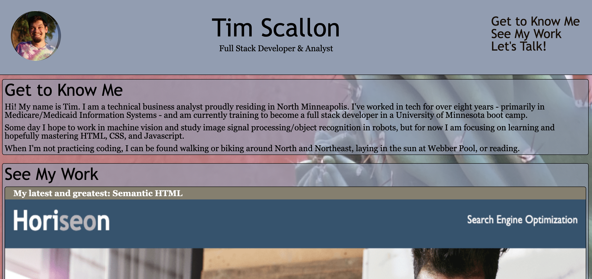

# Module 1 Challenge: Semantic HTML Homework

This Homework assignment was completed for Week One of the U of M Bootcamp, to practice html and css work. It's largely focused on refactoring a starter code for a webpage of a fictional SEO B2B Company, replacing div tags with more specific semantic html tags.

## Link to Deployed Version
[Click here to view the deployed webpage.](https://floatingpoint-exaflop.github.io/coding-portfolio)

## Screenshot of Deployed Version

## Credits

Shoutout to [this blog post](https://www.seoptimer.com/blog/favicon-not-showing-up/) and [this tool](https://favicon.io/favicon-converter/) for the help with my favicon stuff.

Thanks to Eric Meyer for the [start.css](http://meyerweb.com/eric/tools/css/reset/) code. 

## License

Please refer to the LICENSE in the repo.